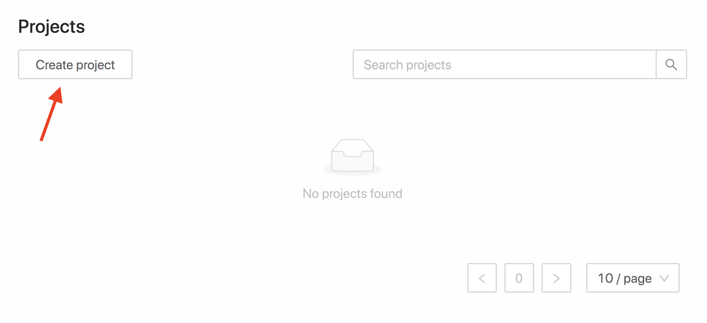
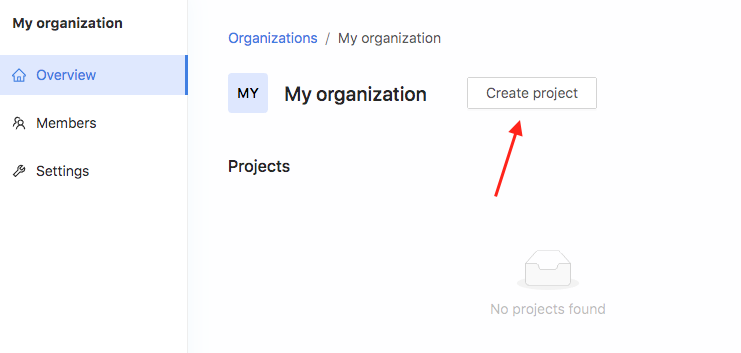

# Create a project

There are two types of projects you can create:

* personal projects and
* projects as part of an organization

The difference between organizational projects and personal projects is that organizational projects share the permissions and settings of the organization they are part of. You can later still transfer projects to other users or organizations so don't worry.

## Create a personal project

To create a project click the **Create project** button on the [projects page](https://app.texterify.com/dashboard/projects).

Fill out the form to create your project. You can change all of this information later on so don't worry. After creating the project you will be presented with the dashboard of your new project.

## Create a project within an organization

To create a project within your organization you need to first select the organization. On the organization dashboard you can create a new project by clicking **Create project**.

The steps for creating an organizational project are then the same as for personal projects.

